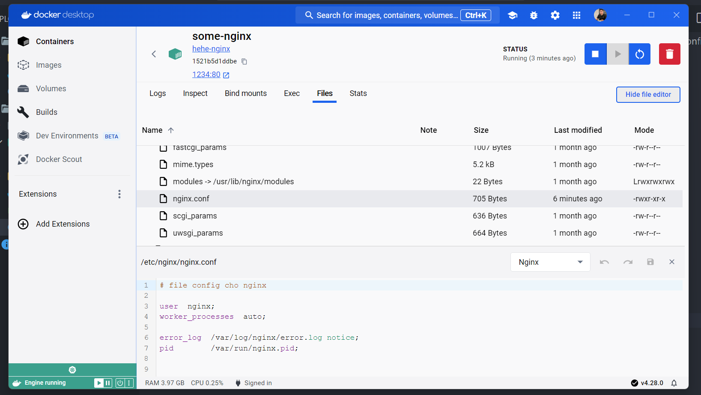

## Test host 1 static html bằng Nginx docker container, bổ sung thêm file config

Sử dụng câu lệnh dưới để lấy ra được config default của nginx

```
docker run --rm --entrypoint=cat nginx /etc/nginx/nginx.conf > ./extract/nginx.conf
```

Sau khi đã có được config, edit nó và build lại

```
docker build -t hehe-nginx .
docker run -it --rm --name some-nginx -d -p 1234:80 hehe-nginx
```

Kết quả file config sẽ được update vào thư mục này



Theo file nginx.conf, truy cập vào địa chỉ dưới để mở được file html

```
localhost:1234/data/www/index.html
```

Để thực hiện các command của nginx đối với container hiện tại

Lấy ra id của container hiện tại, gõ lệnh sau rồi nhìn vào container id mà có image là hehe-nginx đã khởi tạo bên trên

```
docker container ls
```

Dựa vào id của container thực hiện chạy như sau

docker exec <container-id> <command-nginx>

Ví dụ lệnh dưới để reload file config của nginx

```
docker exec 3c9174846c4f nginx -s reload
```
