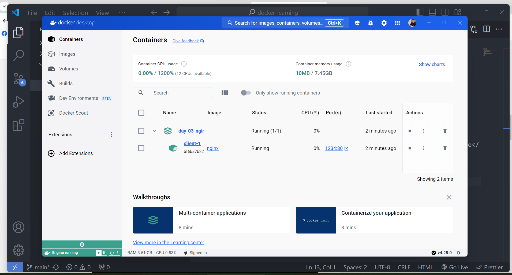

## Sử dụng docker compose để dựng ra được nhiều container

Khi sử dụng docker, có 2 hướng chính.

1 là sử dụng Dockerfile:

Đây là 1 tập lệnh dùng để lắp ráp thành 1 Docker Image.

=> Sau khi build xong phải vất vả gõ các lệnh nào, start port nào như bên dưới, thì chỉ cần nhớ up và down của Docker compose

```
docker run -it --rm --name some-nginx -d -p 1234:80 hehe-nginx
```

2 là sử dụng Docker compose:

Hướng tới việc định nghĩa và chạy nhiều ứng dụng container. (Multi-container Applications).

=> Dockerfile dùng với từng project, sau khi chạy Dockerfile các project sẽ được build thành các Image riêng biệt trong Docker.

=> Docker compose là 1 file YAML sẽ start toàn bộ các image được người dùng tạo từ Dockerfile, mỗi 1 image sẽ run thành 1 container.

## Lưu ý: file yml hoặc yaml phải thụt lề đúng, nếu không sẽ build lỗi

Sau khi đã tạo được Dockerfile và docker-compose.yml, để start container gõ

```
docker-compose up --detach
```

Để stop docker compose, gõ

```
docker-compose down
```

Để build từ file image tùy chỉnh, gõ lệnh dưới để tạo file image mới từ Dockerfile

```
docker build -t hehe-nginx .
```

Sau khi đã có được image hehe-nginx, chạy lệnh trong file hehe-nginx-compose.yml

```
docker compose -f hehe-nginx-compose.yml up -d
```

Để down đúng 1 file vừa start bên trên, gõ

```
docker compose -f hehe-nginx-compose.yml down
```

Kết quả sau khi docker compose up thành công trong app Docker


