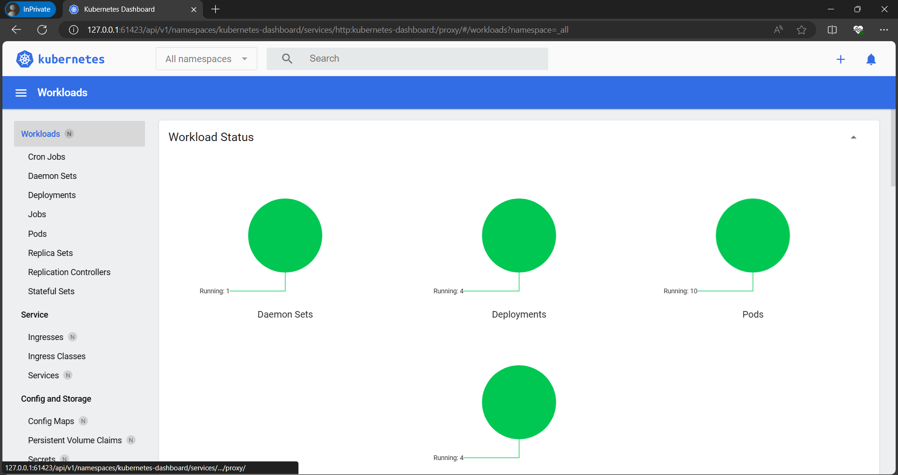

## Tạo ra 1 Deployment trong k8s

1 Pod là 1 nhóm 1 hoặc nhiều container
1 k8s Deployment sẽ hiểm tra sức khỏe của Pod đã tạo của người dùng
và tự động restart các container có trong Pod đó nếu như nó bị dừng
( hiểu là crash hoặc terminated ứng dụng).

Dùng lệnh "kubectl create" để tạo ra Deployment quản lý các Pod. Pod chạy container mà được tạo bởi các Docker image.

### Tạo 1 container image có chứa 1 webserver

```
kubectl create deployment hello-node --image=registry.k8s.io/e2e-test-images/agnhost:2.39 -- /agnhost netexec --http-port=8080
```

Kết quả sẽ như hình dưới



Có thể xem dạng dòng lệnh bằng lệnh dưới

```
kubectl get deployments
```

Đây là file yaml deployment khi bấm vào dấu ... dọc ở hello-node chọn edit


1 số lệnh tự tìm hiểu

```
kubectl get pods
kubectl get events
kubectl config view
kubectl logs hello-node-pod id
```
