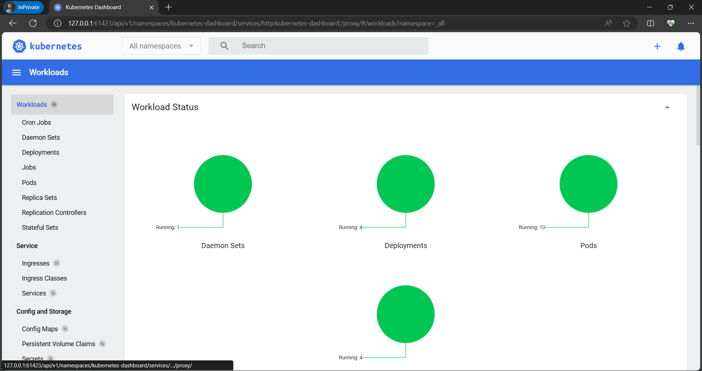

## Hướng dẫn các lệnh minikube cơ bản (chạy k8s local)

Câu lệnh chạy minikube

```
minikube start
```

Khi thấy dòng dưới ở command line là thành công

```
Done! kubectl is now configured to use "minikube" cluster and "default" namespace by default
```

Để dừng minikube gõ lệnh dưới

```
minikube stop
```

Mở Kubernetes dashboard bằng lệnh dưới, sau đó copy url

```
minikube dashboard --url
```

Kết quả sẽ thu được hình bên dưới

