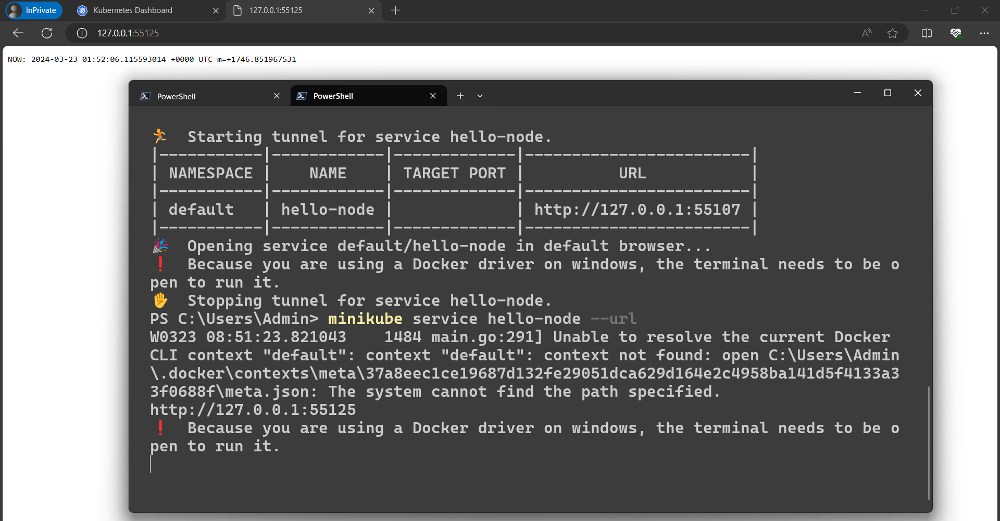

## Tạo ra 1 dịch vụ (service)

1 Pod chỉ có thể truy cập thông qua địa chỉ IP trong Kubernetes cluster.
Để có thể truy cập container hello-node từ bên ngoài mạng ảo của Kubenetes.
Cần phải phơi bày (expose) Pod của Kubernetes như 1 Kubernetes service.

Dùng lệnh "kubectl expose"
Cờ --type=LoadBalancer có nghĩa là muốn expose service ra bên ngoài cluster.

```
kubectl expose deployment hello-node --type=LoadBalancer --port=8080
```

Dùng lệnh dưới để check các service đang chạy
Nếu có service hello-node là đã thành công

```
kubectl get services
```

Dùng lệnh dưới để mở services hello-node trên trình duyệt

```
minikube service hello-node
```



Để xóa service và deployment gõ lệnh dưới

```
kubectl delete service hello-node
kubectl delete deployment hello-node
```
